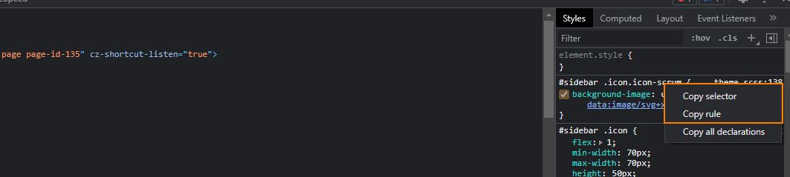

# CSS selector to SCSS

This extensions allows you to convert CSS selectors or rules into nested SCSS.  
It works with the clipboard values you would get from:



This extension got two commands:
* Convert CSS selector to SCSS from clipboard
* Convert CSS rule to SCSS from clipboard

## Convert CSS selector to SCSS from clipboard
This command wil turn a selector in a nested SCSS structure.  
Executing the command with the following value on your clipboard:

```css
#sidebar .title
```

Will result in the following result:
```scss
#sidebar {
    .title {
        |
    }
}
```

## Convert CSS rule to SCSS from clipboard 
This command turns a copied css rule to a nested SCSS structure.  
The following copied code:

```css
#sidebar .title {
	flex: 3;
	font-size: 17px;
	align-self: center;
	white-space: nowrap;
	opacity: 0;
	transition: opacity 300ms ease;
}
```

Will result in:
```scss
#sidebar {
    .title {
        flex: 3;
        font-size: 17px;
        align-self: center;
        white-space: nowrap;
        opacity: 0;
        transition: opacity 300ms ease;
    }
}
```

## Limitations
Currently the plugin only supports single line rules and selectors.  
If a rule or selector contains `,` only the first part will be processed.